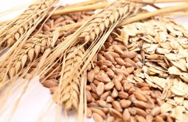
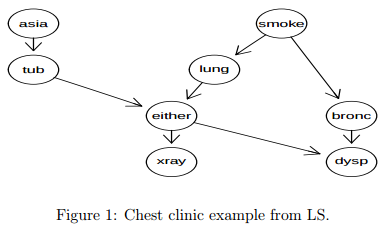

<br/>
First install packages from bioconductor:
```
source("http://bioconductor.org/biocLite.R")
biocLite(c("graph","RBGL","Rgraphviz"))
```
then install "*gBase*", "*gRain*" and "*gRim*.
```
install.packages("gBase")
install.packages("gRain")
install.packages("gRim")
```
*Clinic example of Lauritzen and Spiegelhalter (1988)*
        
    “Shortness–of–breath (dyspnoea) may be due to tuberculosis, lung cancer or
    bronchitis, or none of them, or more than one of them. A recent visit to Asia
    increases the chances of tuberculosis, while smoking is known to be a risk factor
    for both lung cancer and bronchitis. The results of a single chest X–ray do not
    discriminate between lung cancer and tuberculosis, as neither does the presence
    or absence of dyspnoea.”
<center>  </center> 

1. Specify conditional probability tables (with values as given in Lauritzen and Spiegelhalter
(1988)):
```{r, message=FALSE}
library("gRain")
yn <- c("yes", "no")
a <- cptable(~ asia, values = c(1, 99), levels = yn)
t.a <- cptable(~ tub + asia, values = c(5, 95, 1, 99), levels = yn)
s <- cptable(~ smoke, values = c(5,5), levels = yn)
l.s <- cptable(~lung|smoke, values=c(1,9,1,99), levels=yn)
b.s <- cptable(~bronc|smoke, values=c(6,4,3,7), levels=yn)
e.lt <- cptable(~either|lung:tub,values=c(1,0,1,0,1,0,0,1),levels=yn)
x.e <- cptable(~xray|either, values=c(98,2,5,95), levels=yn)
d.be <- cptable(~dysp|bronc:either, values=c(9,1,7,3,8,2,1,9), levels=yn)
```
2. Compile list of conditional probability tables and create the network:</br>
    A network is created with the function *grain()* which returns an object of class
grain. </br>
The *compileCPT()* function does some checking of the specified CPT’s. (For example, it is checked that the graph defined by the CPT’s is acyclic. Furthermore, the
specification of *t.a* gives a table with four entries and the variable tub is specified
to be binary. Hence it is checked that the variable asia is also binary.) The object
plist is a list of arrays and it is from this list that the grain object is created.</br>
Compilation of a grain object based on CPTs involves the following steps: First it
is checked whether the list of CPTs defines a directed acyclic graph (a DAG). If so,
then the DAG is created; it is moralized and triangulated to form a chordal (triangu-
lated) graph. The CPTs are transformed into clique potentials defined on the cliques
of this chordal graph. The chordal graph together with the corresponding clique po-
tentials are the most essential components of a grain object, and one may indeed
construct a grain object directly from a specification of these two components.
```{r}
plist <- compileCPT(list(a, t.a, s, l.s, b.s, e.lt, x.e, d.be))
plist
plist$asia
plist$tub
net1 <- grain(plist)
net1
```
*propagate* If TRUE the network is also propagated meaning that the cliques of the junction tree are calibrated to each other.

3. The network can be queried to give marginal probabilities:
```{r}
querygrain(net1, nodes=c("lung","bronc"), type="marginal")
```
4. Likewise, a joint distribution can be obtained:
```{r}
querygrain(net1,nodes=c("lung","bronc"), type="joint")
```
5. Evidence can be entered in following forms:
```{r}
net12 <- setEvidence(net1, nodes=c("asia", "dysp"), states=c("yes", "yes"))
pEvidence( net12 )
```
we can verify this by computing the marginal distribution: <br/>
$\begin{align}
p(A,D) = \sum p(A,D|T,S,L,E,B,X) & = \sum p(A)p(D|E,B) \\
& = p(A=yes)[p(D=yes|E=y,B=y)+p(D=yes|E=y,B=n) \\ 
& \qquad \qquad +p(D=yes|E=n,B=n)+p(D=n|E=y,B=n)]
\end{align}$

6. The network can be queried again:
```{r}
querygrain(net12, nodes=c("lung","bronc"), type="marginal")
```

7. Building network from data </br>
    *chestSim500* </br>
    Description: Simulated data from the Chest Clinic example (also known as the Asia example) from Lauritzen and Spiegelhalter, 1988.
    
```{r}
library(gRbase)
data(chestSim500, package='gRbase')
str(chestSim500)
head(chestSim500)
g<-list(~asia, ~tub | asia, ~smoke, ~lung | smoke, ~bronc | smoke,
        ~either | lung : tub, ~xray | either, ~dysp | bronc : either)
chestdag<-dagList(g)
simdagchest <- grain(chestdag, data=chestSim500)
simdagchest <- compile(simdagchest, propagate=TRUE, smooth=.1)
querygrain(simdagchest, nodes =c("lung","bronc"),type="marginal")
```

8. Exercise </br>
  + Inference: Using the network built in 7 and given the data of a patient that *asia=yes* and *dysp=yes*, what is the probablity of this patient getting *either* *tub* or *lung*, and what is the probablity of getting *bronc=yes*?
  + If you have extra time left, verify the result in 5. 
  + If you still have time left, you can go through this genetics examples: https://www.r-bloggers.com/grain-genetics-example/.
  
### Issue of high dimensionality

We compute joint distribution $p(V)$ by multiplying all the CPTs:<br/>
<center>$\begin{equation}
p(V) = p(a)p(t|a)p(s)p(l|s)p(b|s)p(e|t, l)p(d|e, b)p(x|e)
\end{equation}$,</center> 

this could give us a huge number of CPTs for larger variables each with more states, e.g. 80 variables with 10 states would have $10^{80}$ CPTs. However, gRain still works with 80 nodes in a genetics network.<br/>
The solution is to *NOT* calcualte the join distribution but perform local computation and send messages between them.  


See details here: http://people.math.aau.dk/~sorenh/misc/2014-useR-GMBN/bayesnet-slides.pdf


### Reference:
https://cran.r-project.org/web/packages/gRain/vignettes/gRain-intro.pdf,
http://people.math.aau.dk/~sorenh/misc/2014-useR-GMBN/bayesnet-slides.pdf
https://cran.r-project.org/web/packages/gRain/gRain.pdf


